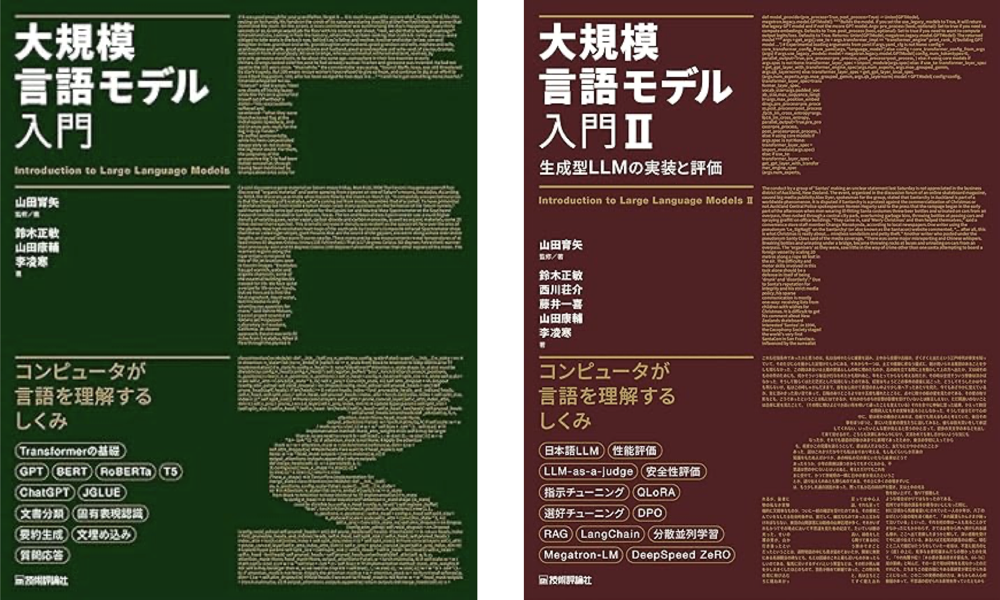
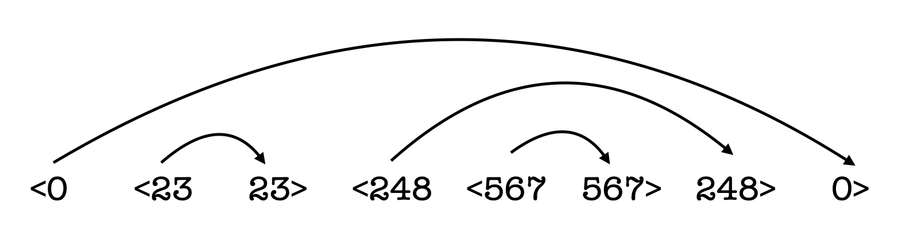
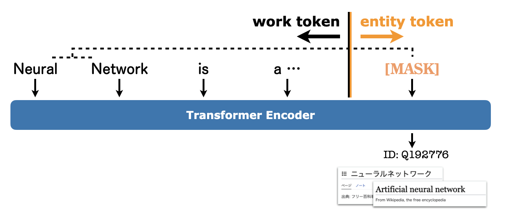

## About Me

I am Ryokan Ri (李 凌寒), a Senior Research Engineer at [SB Intuitions](https://www.sbintuitions.co.jp/), specializing in the development and application of large language models (LLMs).
My primary research interest is in **Natural Language Processing (NLP)**.
Some of my research interests include:

- Multilingual representation learning
- Machine translation
- Intersection of linguistics and machine learning.

In my spare time, I enjoy cooking 🍳 and playing music 🎸.

Links: &emsp;
[Google Scholar](https://scholar.google.co.jp/citations?user=z9is5FAAAAAJ) &emsp;
[LinkedIn](https://www.linkedin.com/in/ryokan-ri-b970a7250/)
[GitHub](https://github.com/ryokan0123)

## Research and Engineering Focus

### Large Language Models

#### LLM Books

I have co-authored books ("Introduction to Large Language Models") on Large Language Models (LLMs) for Japanese practitioners.
These books cover the basics of LLMs with [sample code](https://github.com/ghmagazine/llm-book) and practical tips for training and fine-tuning LLMs.

#### Sarashina: Japanese-centric LLM
I was involved in developing the Japanese-centric LLM [Sarashina](https://huggingface.co/collections/sbintuitions/sarashina-6680c6d6ab37b94428ca83fb).
Sarashina achieved top-class performance in Japanese language tasks among open-sourced LLMs.
This was a result of team effort at [SB Intuitions](https://www.sbintuitions.co.jp/).

#### FlexEval: LLM Evaluation Tool

While many LLM evaluation libraries are available, they cover different domains and methods, and switching between them is cumbersome.
I am developing a unified evaluation tool, [FlexEval](https://github.com/sbintuitions/flexeval), that can be used to evaluate LLMs with various evaluation tasks, metrics, and methods, ranging from few-shot evaluation to LLM-as-a-judge approaches.
It abstracts away various implementations of language models, evaluation datasets, and tasks, allowing users to specify them with configuration files.

### Seeking Language Universals in Neural Networks

My Ph.D. research focused on the commonalities across languages captured by neural network models.

#### ["Pretraining with Artificial Language: Studying Transferable Knowledge in Language Models"](https://aclanthology.org/2022.acl-long.504/), R. Ri and Y. Tsuruoka.

In this work, we investigate the transferability of knowledge acquired through language modeling.
Natural language can be characterized by various linguistic or statistical properties at different levels, which makes it challenging to study which properties are transferable across different languages.

We designed an artificial language with a controlled set of linguistic/statistical properties, pretrained a neural network on it, and transferred it to natural languages.
We found that statistical dependencies are key to transferability.

#### ["mLUKE: The Power of Entity Representations in Multilingual Pretrained Language Models"](https://aclanthology.org/2022.acl-long.505/), R. Ri, I. Yamada, and Y. Tsuruoka.

We developed a multilingual encoder-style language model, mLUKE, that utilizes information about entities (Wikipedia articles) shared across languages.
We demonstrate that including entity information in pre-training improves the performance of cross-lingual transfer tasks.

## Education

- April 2018 - : Tsuruoka Lab., Graduate School of Information Science and Technology, The University of Tokyo
  - April 2020 - March 2023: Ph.D. student
  - April 2018 - March 2020: Master's student
- April 2013 - March 2018: College of Arts an Sciences, The University of Tokyo
  - April 2015 - March 2018: Bachelor of Arts (linguistics)
  - June 2016 - June 2017: The University of Sydney (Student Exchange)
  - April 2013 - March 2015: Natural Science Ⅰ

## Working Experience

- April 2023 - Present: NLP Research Engineer
  - Transferred internally to [SB Intuitions](https://www.sbintuitions.co.jp/) (July 1, 2024)
  - Transitioned to [LY Corporation](https://www.lycorp.co.jp/en/) through company merger (October 1, 2023)
  - Started at LINE Corporation
- April 2020 - March 2023: Research intern at [Studio Ousia](https://www.ousia.jp/en/) in Tokyo, Japan
- July 2020 - September 2020: Research intern at [IBM Research - Ireland](https://www.research.ibm.com/labs/ireland/) (Remote)

## Awards and Honors
- [Research Paper Award](https://www.anlp.jp/award/ronbun.html) from The Association for Natural Language Processing, 2023.
- [Best Paper Award](https://www.anlp.jp/nlp2023/award.html) (2 out of 579) from The Association for Natural Language Processing in NLP 2023 (Japanese domestic conference).
- [Microsoft Research PhD Fellowship 2021 Nomination Award](https://www.microsoft.com/en-us/research/lab/microsoft-research-asia/articles/eleven-phd-students-are-awarded-the-2021-microsoft-research-asia-fellowship-award/).
- [Language Resource Award](https://www.anlp.jp/nlp2021/award.html) from The Association for Natural Language Processing in NLP 2021 (Japanese domestic conference).

### International Conferences / Journals

For the full publication list, please refer to [Google Scholar](https://scholar.google.co.jp/citations?user=z9is5FAAAAAJ).

#### Analyzing Multilinguality of Neural Networks

- R. Ri and Y. Tsuruoka, "Pretraining with Artificial Language: Studying Transferable Knowledge in Language Models", in *Proceedings of the 60th ACL (long)*, 2022. [[anthology]](https://aclanthology.org/2022.acl-long.504/) [[arxiv]](https://arxiv.org/abs/2203.10326/)
- R. Ri and Y. Tsuruoka, "Revisiting the Context Window for Cross-lingual Word Embeddings", in *Proceedings of the 58th ACL (long)*, 2020. [[anthology]](https://www.aclweb.org/anthology/2020.acl-main.94/) [[arXiv]](https://arxiv.org/abs/2004.10813)

#### Multilingual Language Models and Representation Learning
- I. Yamada and R. Ri, "LEIA: Facilitating Cross-Lingual Knowledge Transfer in Language Models with Entity-based Data Augmentation", 2024. [[anthology]](https://aclanthology.org/2024.findings-acl.419/) [[arxiv]](https://arxiv.org/abs/2402.11485)
- R. Ri, I. Yamada, and Y. Tsuruoka, "mLUKE: The Power of Entity Representations in Multilingual Pretrained Language Models", in *Proceedings of the 60th ACL (long)*, 2022. [[anthology]](https://aclanthology.org/2022.acl-long.505/) [[arxiv]](https://arxiv.org/abs/2110.08151/)
- S. Nishikawa, R. Ri, I. Yamada, Y. Tsuruoka, and I. Echizen, "EASE: Entity-Aware Contrastive Learning of Sentence Embedding", in *Proceedings of NAACL*, 2022. [[anthology]](https://aclanthology.org/2022.naacl-main.284/) [[arxiv]](https://arxiv.org/abs/2205.04260/)

### Book
- I. Yamada, M. Suzuki, S. Nishikawa, K. Fujii, K. Yamada, R. Ri, "大規模言語モデル入門 Ⅱ 〜生成型LLMの実装と評価 (Introduction to Large Language Models Ⅱ)", Gijutsu-Hyohron Co., Ltd., 2024. [[Amazon]](https://www.amazon.co.jp/dp/4297143933/ref=sspa_dk_detail_1?psc=1&pd_rd_i=4297143933&pd_rd_w=h8KH7&content-id=amzn1.sym.f293be60-50b7-49bc-95e8-931faf86ed1e&pf_rd_p=f293be60-50b7-49bc-95e8-931faf86ed1e&pf_rd_r=SP1AVY6CYPY4V1Z3WTHN&pd_rd_wg=dNEks&pd_rd_r=d42570e4-198a-49d8-a9bb-ee756db737f5&s=books&sp_csd=d2lkZ2V0TmFtZT1zcF9kZXRhaWw)
- I. Yamada, M. Suzuki, K. Yamada, R. Ri, "大規模言語モデル入門 (Introduction to Large Language Models)", Gijutsu-Hyohron Co., Ltd., 2023. [[Amazon]](https://www.amazon.co.jp/dp/4297136333?ref_=cm_sw_r_cp_ud_dp_V5GSQQDC95V10924G94S)

## Skills

### Natural Languages
- Japanese (Native)
- English (Fluent)
- Chinese (Fluent)

### Programming Languages
- Python (Advanced)
- C++ (Intermediate)
- C (Intermediate)
- Java (Basic)
- Kotlin (Basic)
